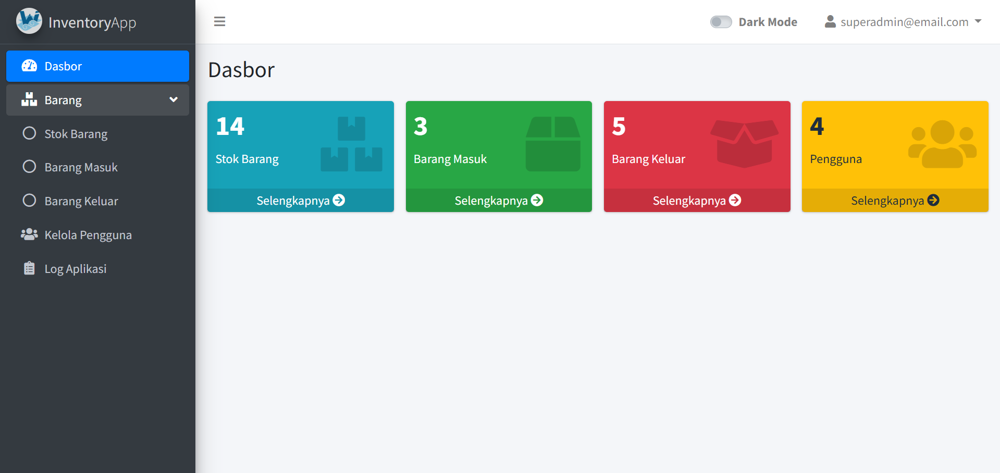
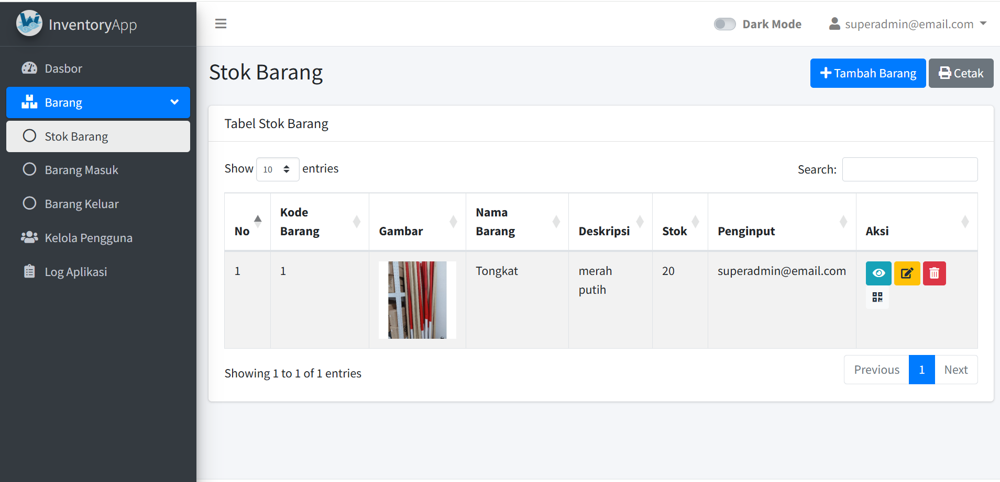
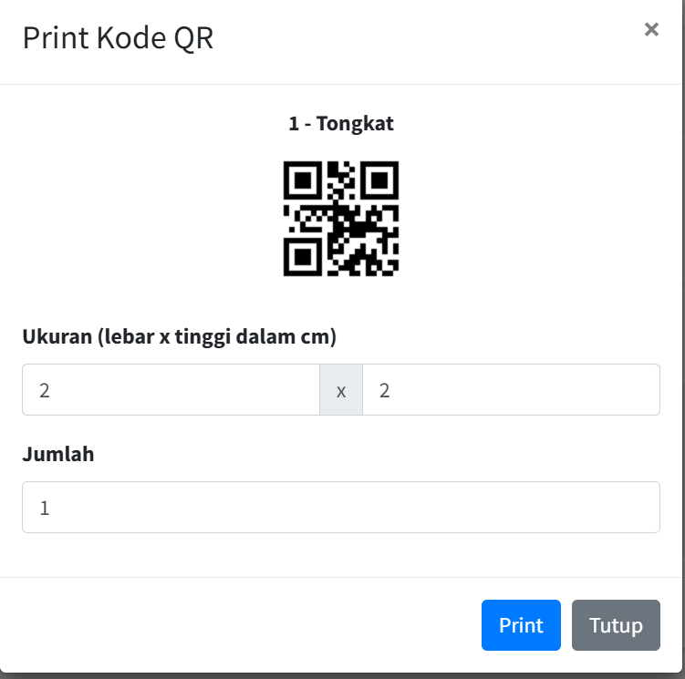
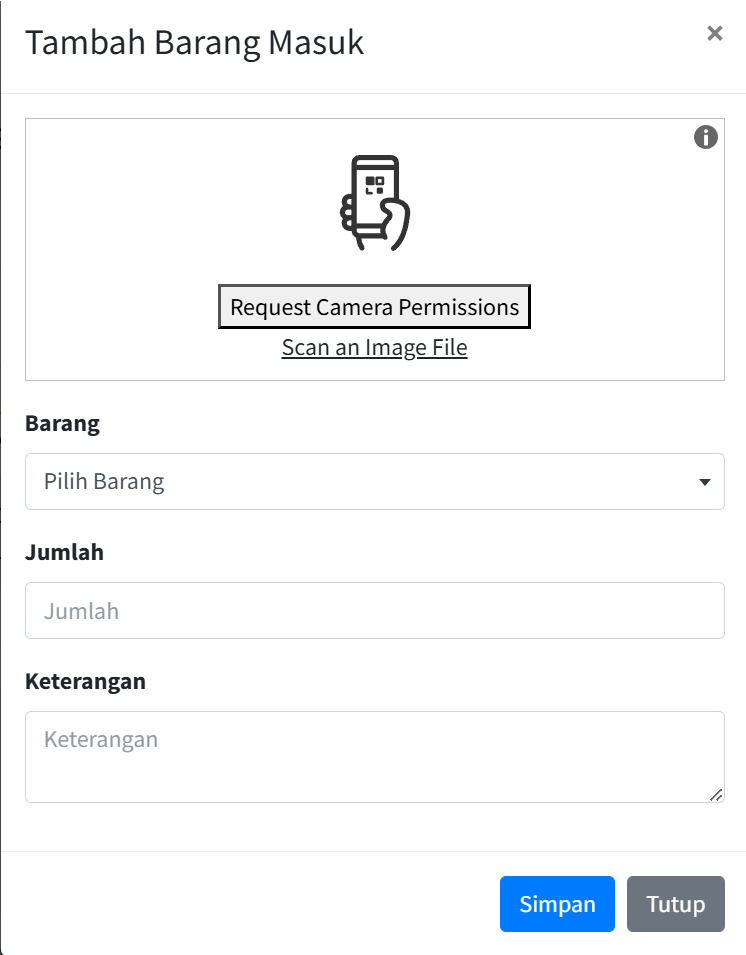
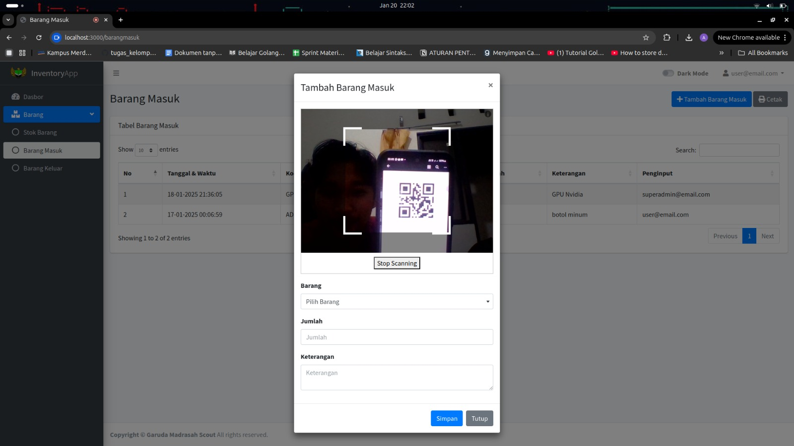
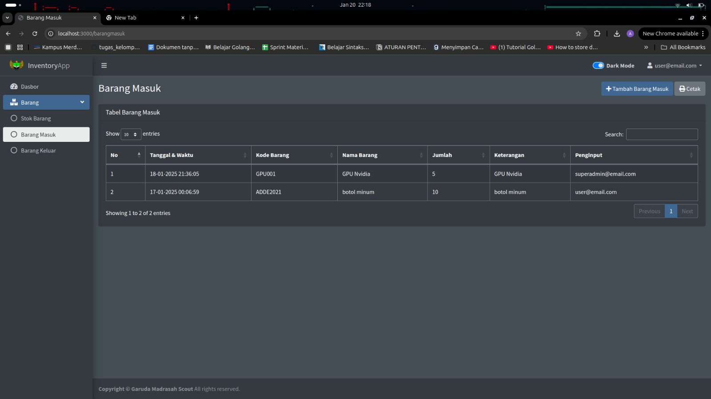

# Sistem Informasi Inventaris Barang

Aplikasi manajemen inventaris barang. Ini adalah produk pra proposal


## Daftar Isi

- [Setup Awal](#setup-awal)
  - [Prasyarat](#prasyarat)
  - [Instalasi](#instalasi)
- [Menjalankan Secara Lokal](#menjalankan-secara-lokal)
- [Fitur Utama](#fitur-utama)
- [Tech Stack](#tech-stack)
- [Screenshots](#screenshots)
  - [Dashboard](#dashboard)
  - [Tabel](#tabel)
  - [Cetak QR Code](#cetak-qr-code)
  - [Scan QR Code](#scan-qr-code)
  - [Mode Gelap](#mode-gelap)

## Setup Awal

### Prasyarat

Sebelum memulai, pastikan Anda telah menginstal perangkat lunak berikut:

- [Git](https://git-scm.com/downloads)
- [Node.js](https://nodejs.org/en/download/current)
- [PostgreSQL](https://www.postgresql.org/download/)

Pastikan juga bahwa PATH sistem Anda mencakup tools PostgreSQL. Untuk pengguna Windows, [lihat instruksi di sini](https://www.commandprompt.com/education/how-to-set-windows-path-for-postgres-tools/).


### Instalasi

1. Clone repositori ini:

   ```bash
   git clone https://github.com/Ahmadfaisal04/Inventory-app.git
   ```

2. Masuk ke direktori proyek:

   ```bash
   cd Inventaris-app
   ```

3. Buat file .env (sesuaikan konfigurasi dengan pengaturan database PostgreSQL Anda):

   ```bash
   cp .env.example .env
   ```

4. Install dependensi:

   ```bash
   npm install
   ```

5. Setup database:

   ```bash
   npm run setup-db
   ```

## Menjalankan Secara Lokal

1. Jalankan proyek:

   ```bash
   npm start
   ```

2. Buka browser dan kunjungi http://localhost:3000 (port dapat berbeda tergantung pengaturan di file

3. Login menggunakan kredensial berikut:

  | email | password | role |
  |---|---|---|
  | superadmin@email.com | superadmin123 | superadmin |
  | admin@email.com | admin123 | superadmin |
  | user@email.com | password | user |
  | usr@email.com | password | user |

## Fitur Utama

- **Generator QR Code Massal**: Memungkinkan pembuatan QR code dalam jumlah banyak untuk item yang dipilih, dengan opsi kustomisasi ukuran dan cetak.
- **Pemindai QR Code Serbaguna**:Memungkinkan pemindaian QR code menggunakan perangkat webcam atau dengan mengunggah gambar.

## Tech Stack

Berikut adalah teknologi yang digunakan dalam pengembangan aplikasi ini:

- **Runtime**: [Node.js](https://nodejs.org/)
- **Web Framework**: [Express.js](https://expressjs.com/)
- **Database**: [PostgreSQL](https://www.postgresql.org/)
- **Template Engine**: [EJS](https://ejs.co/)
- **Styling**: [AdminLTE](https://adminlte.io/) + [Bootstrap](https://getbootstrap.com/)
- **Frontend Interactivity**: [jQuery](https://jquery.com/)

## Screenshots

### Dashboard



### Table



### Print QR Code



### Scan QR Code


)

### Dark Mode




